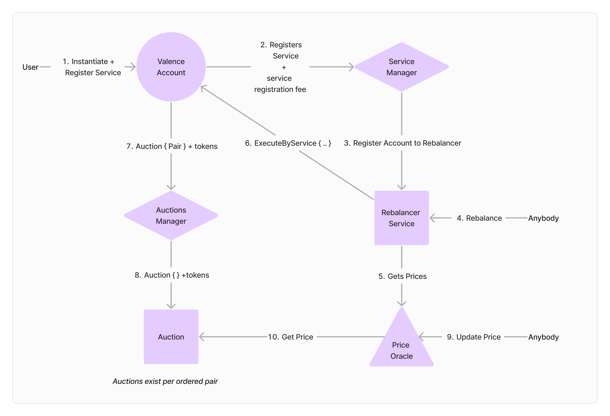

# Valence Services

Valence Services houses the code for the [Valence Rebalancer](https://www.valence.zone/rebalancer). The Rebalancer enables automated balance sheet and treasury management. Use the Rebalancer to efficiently convert tokens for scheduled payments or manage your digital organization’s asset portfolio. The Rebalancer is custom-built to address the needs of blockchains, protocols, and decentralized autonomous organizations. 

Learn more about the Rebalancer [here](https://www.valence.zone/blog/Rebalancer-Protocol-Asset-Management).

This repository contains the following contracts:
- Auctions Manager
- Auction
- Oracle
- Services Manager
- Rebalancer
- Account

The following is a simplified diagram of the Valence Services system. Detailed system diagrams are presented in [Valence Services Architecture](./architecture.md)

For documentation on specific contracts, please refer to the README.md file in each contract's directory.

### ⚖️ DAO Treasuries
The Rebalancer is purpose built for treasury managment. If you are a member of DAO that is interested in using the Rebalancer, please send us a [direct message on X](https://x.com/TimewaveLabs).

### 💸 Market Makers
The Rebalancer sends funds to be auctioned daily. If you are a market maker interested in bidding in these auctions and would like support, please send us a [direct message on X](https://x.com/TimewaveLabs). For more information on auctions:
- Read the [Auctions contract documentation](./contracts//auction/auction/README.md)
- Check out Timewave's [Auction Arbitrage Bot](https://github.com/timewave-computer/auction-arbitrage-bot) that can be used to arbitrage auctions and various DEXs

## Neutron Mainnet Contracts

### Addresses

- Services manager - `neutron1gantvpnat0la8kkkzrnj48d5d8wxdjllh5r2w4r2hcrpwy00s69quypupa`
- Auctions manager - `neutron13exc5wdc7y5qpqazc34djnu934lqvfw2dru30j52ahhjep6jzx8ssjxcyz`
- Rebalancer - `neutron1qs6mzpmcw3dvg5l8nyywetcj326scszdj7v4pfk55xwshd4prqnqfwc0z2`
- Oracle - `neutron1s8uqyh0mmh8g66s2dectf56c08y6fvusp39undp8kf4v678ededsy6tstf`

### Auctions addresses

- [uatom, untrn] - `neutron1l9zmckc8j7zhutx088g6ppd9dfs45jet6dyq3pypc0gt5h9ncsvs5m4tsz`
- [untrn, uatom] - `neutron13jppm4n77u8ud5wma9xe0dqnaz85ne9jem3r0scc009uemvh49qqxuuggf`

- [uusdc, uatom] - `neutron1ku4zrr40u7w2265xustm3rj2ld5022p5u95e5q6sckekyrs59r8q9q0zdn`
- [uusdc, untrn] - `neutron18svf2f9eltzr4dm2p8q4jnxyu2sjejpggxhcvaspeq8vaj4gdtuqdg2z2f`
- [uatom, uusdc] - `neutron1uf23w2ejztrz0sz92x26tnavdatyxwq4axt96zqaxc7sshalx4nqxj89sd`
- [untrn, uusdc] - `neutron1r7ytd0m9j5t668wg7e9u287f9kzfxqulwuslexjeqjvwas0qzxjs67kzq6`

- [newt, uatom] - `neutron1dz6kyp6sh5myulmmna6wt62kc65xkccrp7f5sqfqyv4vdkte885s00zm3p`
- [newt, untrn] - `neutron1dajsjk985c29tv5v985gvd55vzllx97aaw0ekurty62xwf3l53usrhcf3t`
- [newt, uusdc] - `neutron1qdp2qhtt2jyefn0dqxsl7ffah9xmm8jxg3z462u42rp424eecrms2rshxg`
- [uatom, newt] - `neutron1fyk77ttx2j3wxjj26g3d8csjzp005cxdacstfxcrdexpn8nsz79qhjhpsd`
- [untrn, newt] - `neutron1zvw9l8c82hnvwsntpuy89p86ztfmmudd9usfmnpa2tnqws74zsxq56sczm`
- [uusdc, newt] - `neutron1vu04szc78ae0nplwpuxjr6j592hn2d60zqtuts7w3ah6kajtxd2q2vfv59`

## Audits

Valence Services have been rigorously tested and audited. Find audits [here](./audits/)

## Security

If you believe you've found a security-related issue with the contracts associated with this repository, please disclose responsibly by contacting the Timewave team at [security@timewave.computer](mailto:security@timewave.computer).

## License

All materials in this repository are licensed under [BSL](./LICENSE).
