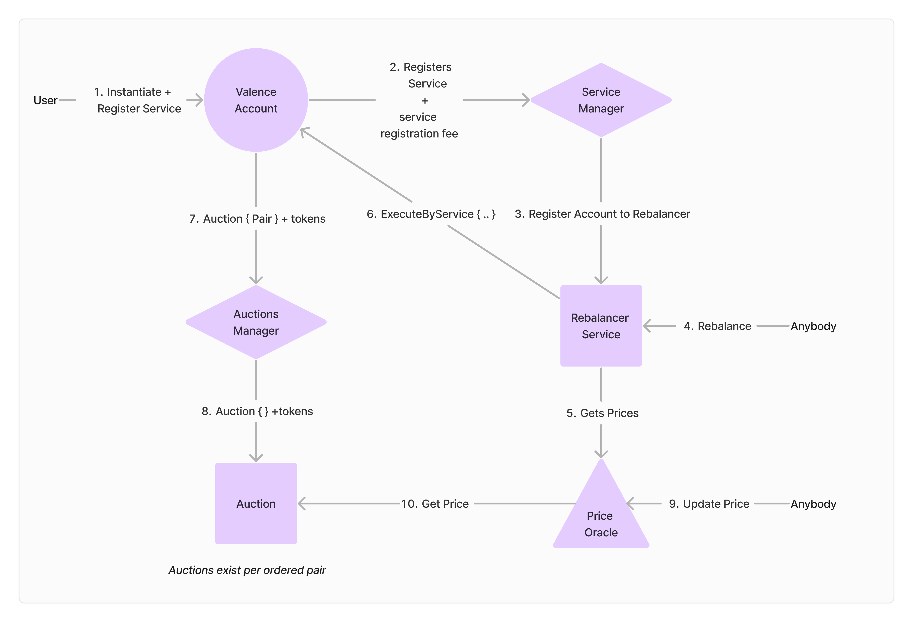

# Valence Services
> ⚠️ This project is no longer actively maintained. If you have have funds in the Rebalancer, please see the bottom of this README for instructions on withdrawal. The rest of this repository is left as is for reference.

The Rebalancer enables automated balance sheet and treasury management. Use the Rebalancer to efficiently convert tokens for scheduled payments or manage your digital organization’s asset portfolio. The Rebalancer is custom-built to address the needs of blockchains, protocols, and decentralized autonomous organizations. 

Learn more about the Rebalancer [here](https://www.valence.zone/blog/Rebalancer-Protocol-Asset-Management).

This repository contains the following contracts:
- Auctions Manager
- Auction
- Oracle
- Services Manager
- Rebalancer
- Account

The following is a simplified diagram of the Valence Services system. Detailed system diagrams are presented in [Valence Services Architecture](./architecture.md)



For documentation on specific contracts, please refer to the README.md file in each contract's directory.

### ⚖️ DAO Treasuries
The Rebalancer is purpose built for treasury managment. If you are a member of DAO that is interested in using the Rebalancer, please send us a [direct message on X](https://x.com/TimewaveLabs).

### 💸 Market Makers
The Rebalancer sends funds to be auctioned daily. If you are a market maker interested in bidding in these auctions and would like support, please send us a [direct message on X](https://x.com/TimewaveLabs). For more information on auctions:
- Read the [Auctions contract documentation](./contracts//auction/auction/README.md)
- Check out Timewave's [Auction Arbitrage Bot](https://github.com/timewave-computer/auction-arbitrage-bot) that can be used to arbitrage auctions and various DEXs

## Neutron Mainnet Contracts

[](https://github.com/timewave-computer/valence-services/actions/workflows/check.yml)

### Addresses

- Services manager - `neutron1gantvpnat0la8kkkzrnj48d5d8wxdjllh5r2w4r2hcrpwy00s69quypupa`
- Auctions manager - `neutron13exc5wdc7y5qpqazc34djnu934lqvfw2dru30j52ahhjep6jzx8ssjxcyz`
- Rebalancer - `neutron1qs6mzpmcw3dvg5l8nyywetcj326scszdj7v4pfk55xwshd4prqnqfwc0z2`
- Oracle - `neutron1s8uqyh0mmh8g66s2dectf56c08y6fvusp39undp8kf4v678ededsy6tstf`

### Auctions addresses

- [uatom, untrn] - `neutron1l9zmckc8j7zhutx088g6ppd9dfs45jet6dyq3pypc0gt5h9ncsvs5m4tsz`
- [untrn, uatom] - `neutron13jppm4n77u8ud5wma9xe0dqnaz85ne9jem3r0scc009uemvh49qqxuuggf`

- [uusdc, uatom] - `neutron1ku4zrr40u7w2265xustm3rj2ld5022p5u95e5q6sckekyrs59r8q9q0zdn`
- [uusdc, untrn] - `neutron18svf2f9eltzr4dm2p8q4jnxyu2sjejpggxhcvaspeq8vaj4gdtuqdg2z2f`
- [uatom, uusdc] - `neutron1uf23w2ejztrz0sz92x26tnavdatyxwq4axt96zqaxc7sshalx4nqxj89sd`
- [untrn, uusdc] - `neutron1r7ytd0m9j5t668wg7e9u287f9kzfxqulwuslexjeqjvwas0qzxjs67kzq6`

- [newt, uatom] - `neutron1dz6kyp6sh5myulmmna6wt62kc65xkccrp7f5sqfqyv4vdkte885s00zm3p`
- [newt, untrn] - `neutron1dajsjk985c29tv5v985gvd55vzllx97aaw0ekurty62xwf3l53usrhcf3t`
- [newt, uusdc] - `neutron1qdp2qhtt2jyefn0dqxsl7ffah9xmm8jxg3z462u42rp424eecrms2rshxg`
- [uatom, newt] - `neutron1fyk77ttx2j3wxjj26g3d8csjzp005cxdacstfxcrdexpn8nsz79qhjhpsd`
- [untrn, newt] - `neutron1zvw9l8c82hnvwsntpuy89p86ztfmmudd9usfmnpa2tnqws74zsxq56sczm`
- [uusdc, newt] - `neutron1vu04szc78ae0nplwpuxjr6j592hn2d60zqtuts7w3ah6kajtxd2q2vfv59`

## Neutron Testnet Contracts

[](https://github.com/timewave-computer/valence-services/actions/workflows/check.yml)

### Code ids

- auctions-manager - `5673`
- auction - `5679`
- services-manager - `5674`
- rebalancer - `8367`
- oracle - `8371`
- account - `5677`

### Addresses

- Services manager - `neutron13ncggwefau3xla04vlugy20meap7g7a9lf2d2sxwgwvgr9mnn3yqkpjzs6`
- Auctions manager - `neutron1669ftav8rv4hjuak89w04k7f0f7m9qq9564s00ld4m8dvhsr5hfsxy3x46`
- Rebalancer - `neutron1y9aurkegmqlqwhsnwctee4w4aja7n64yuat800p8yys509pyl0fsvrmydm`
- Oracle - `neutron1g4qcmk65nw57hmqlzk6cejnftg20zmctky0l2epdfz3npw3x2cmqprul6f`
- Account - `neutron1gc3tt3edg3drsc3aa22du9pa9f9s2gx6reu2hvq7s6yrdmy8zqjssfj52p`

### Auctions addresses

denom - `factory/neutron1phx0sz708k3t6xdnyc98hgkyhra4tp44et5s68/rebalancer-test`

- [untrn, test] - `neutron10p7d4ca0a5a3plx0d3dw0qmrnldfxwgq8q48205za6pgyhmqqzasg58fg4`
- [test, untrn] - `neutron1s859kh0cgte55fmgtksylw5khv8yxvhslpxmpqdy46fv8q7wxj8qtplru4`

## Security

If you believe you've found a security-related issue with the contracts associated with this repository, please disclose responsibly by contacting the Timewave team at [security@timewave.computer](mailto:security@timewave.computer).

## License

All materials in this repository are licensed under [BSL](./LICENSE).

## Withdraw funds from the Rebalancer without the UI

To withdraw assets from the Rebalancer without the UI
### 1. Find the Valence smart contract account associated with your wallet. 

<details>
  <summary>Accounts list</summary>
  
| Valence Account  | Wallet/DAO Address |
|------------------|---------------|
| `neutron12afgur80kf3s45r22uwmx8a4fgpdg78pgdlxsj267tugm9pdp5csutssrp` | `neutron1hhpggzq6a38max92da5j2w40mrt0rwz6nt3x5u` |
| `neutron13pvwjc3ctlv53u9c543h6la8e2cupkwcahe5ujccdc4nwfgann7ss0xynz` | `neutron180fak0g68gfjs42lsgnp8ptfamq7ysc820tm3pxawswx0zqkv85smp2z59` |
| `neutron173hvzyja4447jlqkkvjdejjwlwk9eaam27q2psm3evy70f7z34pq5247np` | `neutron100t2cl9f8880ffa5khgn742f7ful08yefnynv6` |
| `neutron1e5smuf8r5xzpfdgem2p8z52wfw97pl2lj4679es9u9d6hv5552eq6ghewc` | `neutron1lqhw66n563pr2vszv4zqhjp7akwpd74vfj5gukh2crw45t5kfmvsa96ujv` |
| `neutron1hr8r6fjaxeskedhzk0af7f06fsgkcm2sqy8c627rl7y7efq9sazqgemn0c` | `neutron1sxfdv7w9rvdhhtzf22pwg5ue4sha562hf2h0m8zxdxye0d9whwvsqxnzh7` |
| `neutron1k0s4wlxgzglj4q7d7q5pal0y5plwkzgxwtw5kus7y8zksflpkldsejszkc` | `neutron100t2cl9f8880ffa5khgn742f7ful08yefnynv6` |
| `neutron1phz37ak3zxmj9gpz9qsyvl8sntkdtllnp992jgqyfhxr4gyp8rcsfccjus` | `neutron1wa23amy9vpt9qavhsurg044vyghpakse6jdz6lkyg2lmjhuplelqtvfnjz` |
| `neutron1pp8yswp0qufxagdff3xapte08hxe6y72k7c5len6e7fz5djgncks2deguy` | `neutron1sap0cdw8jsdy79c8947z2qjeeh9w5dgmza6gvnqkc4p8889su8lq395jnn` |
| `neutron1pwml2hk6j45agal89te9vkm4q8k7txllec0c6ypc9mwdznqy848sn60w73` | `neutron10ktvxsnxzmz9fpxq2cwf2zdy8fclzlc0rczscljl0484ga5gnmgsvl4na5` |
| `neutron1qkf4cnt0e6lgvdyg5lfrf274zlsrv553mmrmgrq4yyep2r0jpa9s46jlt3` | `neutron15p3a5qm9jc0yuukcphgln2mk4yh2aqqr0g4y5adzupmrdlg8xewsskrj49` |
| `neutron1yd27kgnsjkeddwtuy29q9yzrnd247v6hcml6swl54dfkcwuuytqs8ha94x` | `neutron1v7ntl4lfmr4eusqhfw3gwx9rwj3ap5g3e5x8gey7xlsftnusl74qkex332` |
| `neutron1yq30m0c6vuq666uc3xv5q0re9cvfprg7tsatrhzcx63sqj7vq62qpt4qx7` | `neutron1cm9ckhh8839tpwvpqqqsdvvra32z5p8w97trje` |
| `neutron12f9yu8xf8j9hwhnd205suufuz3g64dgyfj348nt2pj4m6s5hhcxqmfcrg5` | `neutron1ckwz27dr3qhn2uegkvdkvw26wl5sslp7303axx` |
| `neutron12kqnluj54h0suutyegt2trwx95xsejsxkpcl2qv0ydsnvq22fdus60589s` | `neutron1jek9anexgx76e9j429crjawanl0gxwu7j4zf29al8662mygeynpq0ydfw5` |
| `neutron12trh6edcs88j5265ugkpprqnpsctpsd3u29w69ye9gseghauuj7ssyfh5m` | `neutron100t2cl9f8880ffa5khgn742f7ful08yefnynv6` |
| `neutron13m6jlu54p2eycz89xh23l3lqxyykrnff0t9sfyw7pyzm2czut6es9pammv` | `neutron1vf2g5yc3d2k757qkuccpl787020wretfe9lenm` |
| `neutron14m6pmlcw70s0stqzaxfktq0jl73xnj43tngc3p4ss7f4strf530q2jkevt` | `neutron100t2cl9f8880ffa5khgn742f7ful08yefnynv6` |
| `neutron17vkk95rdepxflvm7dpjpdsl8xh697paltdgwl5flck9f4wuxd0kqtauj49` | `neutron19v2mmxeev53uxrxnq86d929ws4rw3ev86g5n9s` |
| `neutron19nd99fe02ktl8fz32mhqnpq7fgnejdccjv24ejr68gl5ed3d472qypzqnf` | `neutron1d8c92vzp5lxgvaxhl34c2hv5uvtjc08tl4epz3efyyxgt4zwdc5qvtnefx` |
| `neutron1adl9puhcdqwpm9smljsye3uz22wlsa0mfvkz3vzdkl722mdfpqms97ywhr` | `neutron1xct7ff53e554rpt0x7dt7meqjupmrx8c9na8tzrvj475gcxcfpysjf8vnd` |
| `neutron1d0sr3zh8sqa86vhgdpclh9g2zfdw4hauwtyaqa39mq79ehkjd3fqcp8k85` | `neutron1a8ahlylac8kqrkgdfnynmdsu9dvclrdrdgznpl` |
| `neutron1ekacf890uzenyhnxpttlunmp44cupqz6l2j72vtq5xa60zsz6tpsxekq40` | `neutron100t2cl9f8880ffa5khgn742f7ful08yefnynv6` |
| `neutron1fzac93v0f7vpqqevpyc3d4jg6dtcvk27zsgpdzppvtd9y9pmnwdsw2vxns` | `neutron15cwfpelqcgzpzaq2q85pglqyljm6ulu54xjgdl` |
| `neutron1glutzh6mcmxne8n8ntmgye3tzmejapxcmv23zwpd5hdsrtuva77syx539q` | `neutron13s5agflvjpv3gyjvyfzunnlql40ekfslmu3v2l` |
| `neutron1n4zq32dup5g9ltzgcugr3m2ejcmgyxna0068t6209sl7fs3w7z4qqtvtmw` | `neutron100t2cl9f8880ffa5khgn742f7ful08yefnynv6` |
| `neutron1pkk88zqjd478x3maws3mv7qugylhsu0sjkejj3k2w02wwhp6fqgsl7m0js` | `neutron1phx0sz708k3t6xdnyc98hgkyhra4tp44et5s68` |
| `neutron1taxegcvyuxrvucrk9k5w055xswn8gchefrfk3plggpl8yq8dktuser2475` | `neutron1ep2umj6kn34g2ttjalsc5r9w8pt7sv4xpaxzsa` |
| `neutron1vw0zuapgkpnq49ffyvkt4s4chy9lnf78s2ezuwwvd95lq065fpes277xkt` | `neutron17k6l4snzahlyy074f64tpynmuvsj8z33ky7vnqcfhjvyluev7yqsexhcde` |
| `neutron1wcv0c8ktmjgtj0a5dt6zdteer2nsyawqtnm5kxt7su5063dudz8qasjl97` | `neutron1flwfk39vstue66h8ljm3x5lvc8pe0y7sl7kqmj2es4r7jh5et7qq0efexk` |
| `neutron1y43le75tp3wf8l92szhmmxrxt863sqc5mxfllgrr72h5xn0f0euqrugv6c` | `neutron199srlulg9ztpdu7p6w7umnx8k3hqnyj2rtnwpl` |
</details>


### 2. Execute the following message on the Valence smart contract account from your wallet. 

You can use celatone. Or if you used DAO DAO initially to create your Valence account, then you can propose a smart contract execute message as an action on the Valence account.

```json
{
  "execute_by_admin": {
    "msgs": [
      {
        "bank": {
          "send": {
            "to_address": "your ntrn address",
            "amount": [
              {
                "denom": "denom as string(e.g., untrn or ibc/xyz)",
                "amount": "amount as string"
              }
            ]
          }
        }
      }
    ]
  }
```


