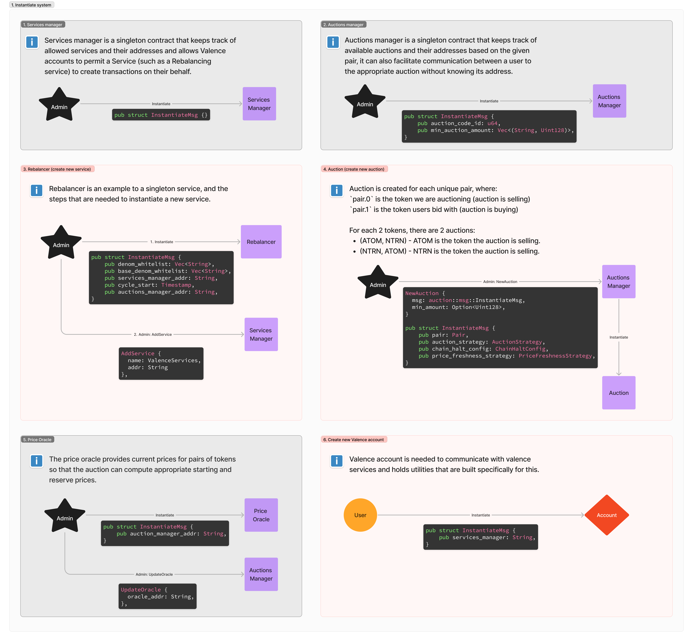
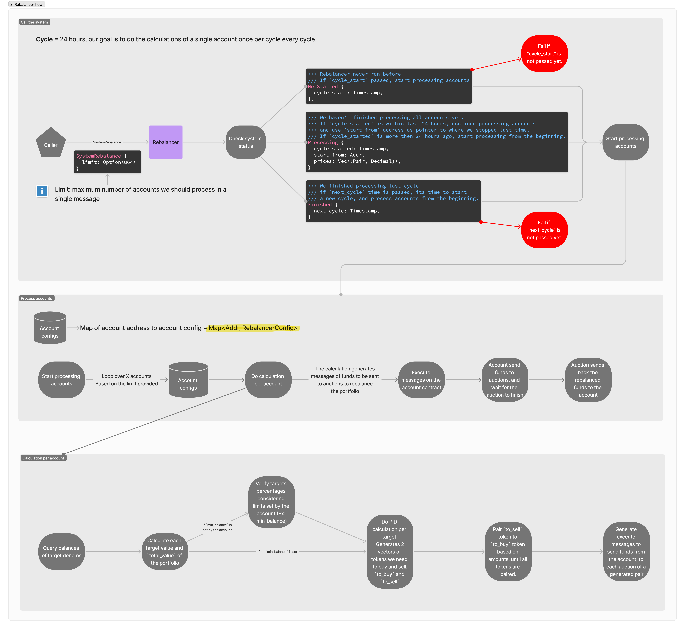
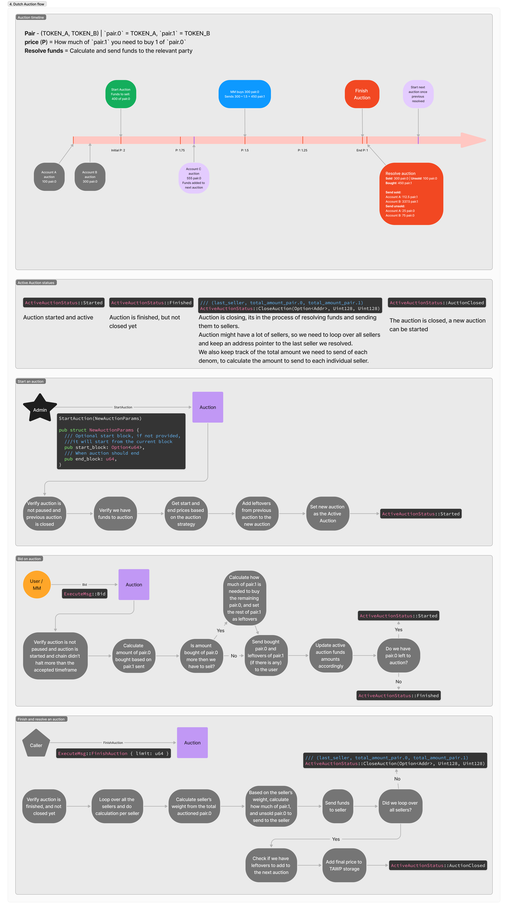
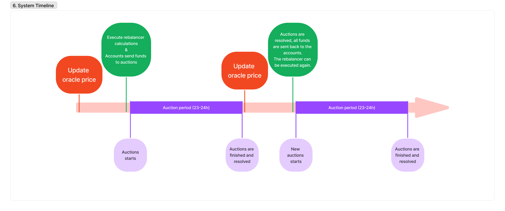

# System Architecture

The full figma diagram can be found [here](https://www.figma.com/board/o5hUA2cS7dV82gJYb3nLhN/Valence-Services?node-id=0-1&t=IfEzfIERC7KCJbKz-1)

## System Instantiation

## Account interaction

## Rebalancer

## Auctions

## Oracle

## System flow
