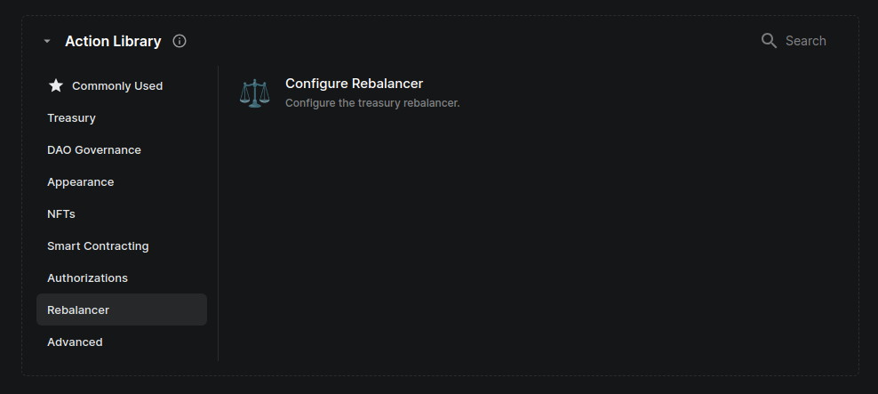
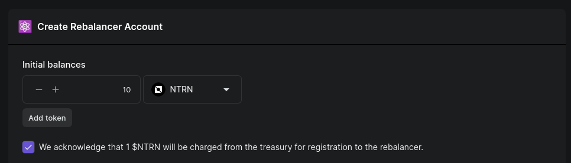
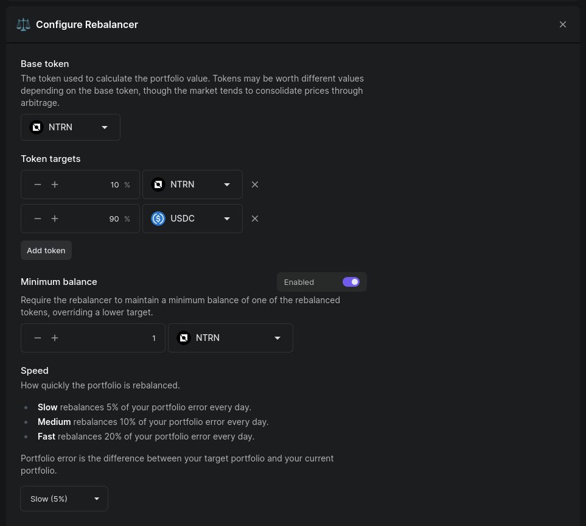
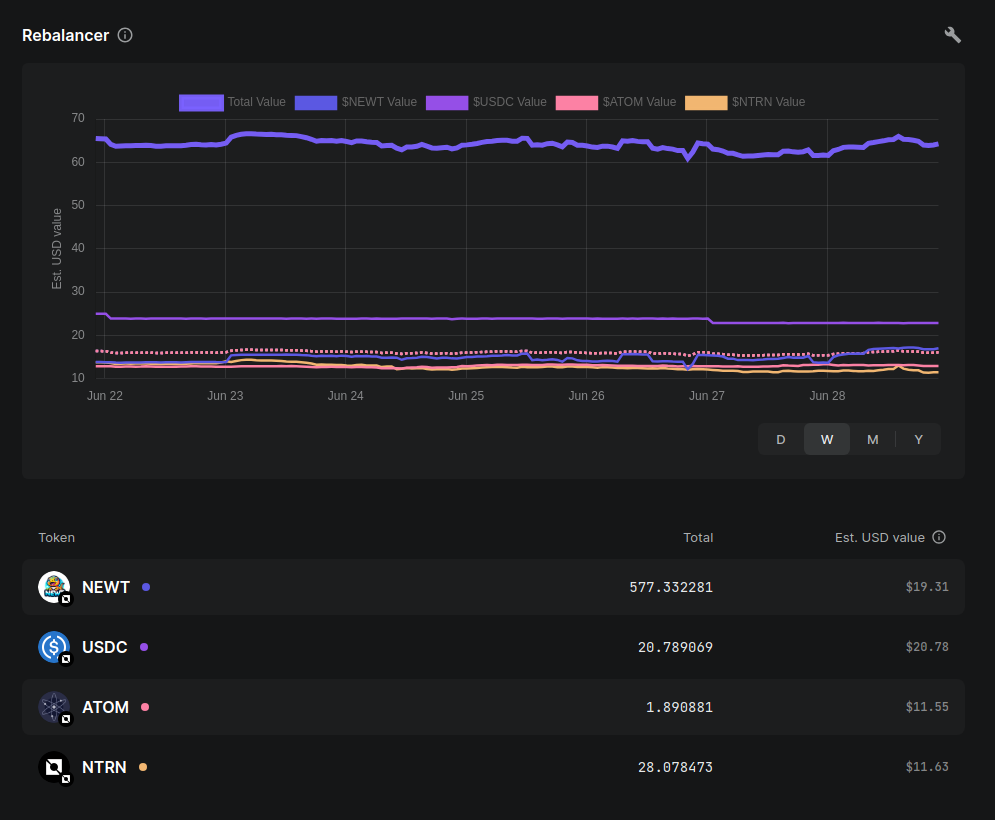
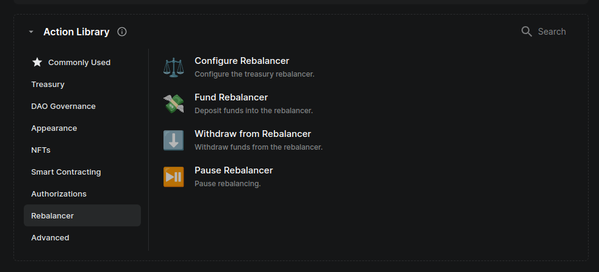

# Rebalancer User Guide

## Introduction

The Rebalancer is a service designed for DAOs and individual users to manage their portfolio or treasury by setting their desired target. During each daily rebalance cycle, the service determines which assets need to be bought or sold to reach their target. Assets marked for sale are then auctioned off, allowing anyone to place bids on them. To begin using the Rebalancer service, users must first create a Valence account and register to the Rebalancer service.

## How to use it

### DAODAO

DAODAO offers a simple user interface to create an account, register with the Rebalancer, and configure the desired targets and other parameters, in a single step. Users can then view the account's status, and manage it effectively. Here are the steps:

1. Create an account and register to the rebalancer.

First we create an account and register to the Rebalancer. This is easily done by creating a Rebalancer proposal.

By clicking on `Configure Rebalancer`, a modal will open with two actions: `Create Rebalancer Account` and `Configure Rebalancer`.

The `Create Rebalancer Account` action allows you to set up an account and fund it with the specified initial balances, along with the registration fee for the rebalancer (currently 1 NTRN). Example:

In the example above, we are creating an account and funding it with 11 NTRN: 10 NTRN will be used as the account balance and 1 NTRN as the registration fee.

**NOTE:** Not all tokens are supported by the Rebalancer. The Rebalancer has a set of whitelisted denoms that it supports. Additionally, each account must be configured with a `Base token`. The account value is denominated in this token. Each account is required to maintain a minimum balance (specified differently for each `Base token`). The following example illustrates this concept:

> An account configures their `Base token` to be NTRN. The minimum balance required for this account is 10 NTRN. This does not mean that the account must possess at least 10 NTRN tokens. Rather, it means that 10 NTRN worth of tokens in the whitelisted denoms must be present in the account. The account can be created with 5 NTRN token and 5 ATOM tokens, for example, as long as the 5 ATOM + 5 NTRN are valued greater than 10 NTRN tokens which is the minimum balance requirement.
> Minimum balances are specified per `Base token` so it is possible that the minimum balance requirement is met under one `Base token` but not under another.

The second action allows you to configure the Rebalancer for your account. This involves several inputs that are self-explanatory in the user interface. One important detail to note is that the `Base token` must be one of the tokens provided in the `Initial balances` and must be present in the `Token targets`. Here's an example:

In the configuration above, and considering that our initial balance was 10 NTRN, we are setting the `Token targets` to 10% for NTRN and 90% for USDC in dollar value. This means that the Rebalancer will slowly sell NTRN and buy USDC until we have 1$ in NTRN for every 9$ in USDC. We could speed up this process in the `Speed` section. At least one of the tokens in `Token targets` must be one funded in `Initial balances`.
In the advanced section we also have the option to provide a maximum % of our portfolio value that can be auctioned off in every cycle and the option to decide how to deal with conflicts between the `Minimum balance` (if specified) and the `Token targets`.

Once the proposal is executed, it will create an account and register it with the parameters we provided and the Rebalancer will start managing our portfolio.

2. View the account and Rebalancer status.

After registering with the Rebalancer, the `Rebalancer` section will appear under `Treasury` in our DAO's treasury section. Initially, and before the first cycle, this section will have no data. However, once the first rebalance occurs, it will display a graph along with the token amounts and values of our account. Here's an example:

For this account, the Rebalancer is currently managing four tokens: NEWT, USDC, ATOM, and NTRN. The graph displays the dollar value of these tokens at any given time, the percentage of the portfolio they represent, and the target set for each token in the Rebalancer.

3. Manage the account.

If we need to perform admin actions on the Rebalancer, we can do so by creating a proposal, similar to how we initially created the account. Since the Rebalancer account is already set up, we will now see additional possible actions:

As shown in the image above, you can reconfigure the Rebalancer with new parameters, which will open the `Configure Rebalancer` modal used in Step 1. Additionally, you can fund the account with tokens from the DAO treasury, withdraw tokens to the treasury, and choose to pause or resume the Rebalancer.
